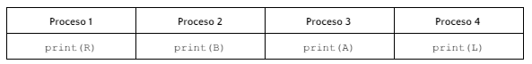

# Biblioteca Medrano
En estudio profundo del lenguaje español, un conjunto de científicos decide modelar con procesos la generación de una palabra del diccionario: “ALABAR”

Permita que los procesos generen infinitamente la palabra deseada, sin que se produzca deadlock ni starvation y utilizando solamente semáforos.

Nota: este ejercicio vamos a hacerlo con hilos para enfatizar en el uso de semaforos y hilos en c