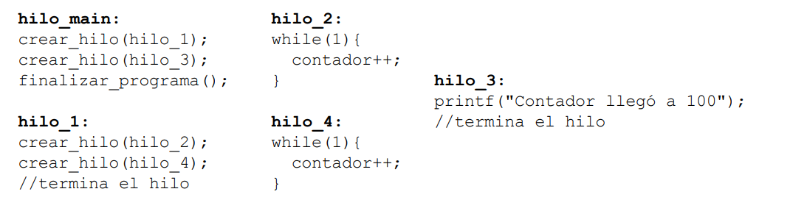

# Hilos de Luciano
Luciano pone en práctica sus conocimientos de hilos y desarrolla un pseudocódigo en el cual se desea que los hilos se creen en orden ascendente (del 1 al 4), que la variable “contador” llegue (y no supere) a 100, luego se imprima el mensaje “Contador llegó a 100” y por último finalice el programa.
Sincronice el mismo utilizando solamente semáforos, eliminando condiciones de carrera y sin generar deadlocks ni starvation

Notas:
- “contador” es una variable entera global inicializada en 0.
- Se considera que un hilo es creado en el momento que se ejecuta la función crear_hilo.
