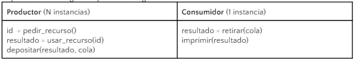

# Productor Consumidor
Se dispone de varios procesos productores, que utilizan un recurso solicitado al azar, para luego depositar el resultado en una cola compartida. Luego un único proceso recibe esos resultados y los imprime. Dado el siguiente pseudo-código:

Se desean encontrar soluciones, utilizando únicamente semáforos, para respetar las reglas establecidas, sin que se produzca deadlock ni starvation, considerando lo siguiente:
a) Una solución que priorice minimizar el tiempo incurrido en regiones crîticas
b) Una solución que priorice llevar al mínimo la cantidad de semáforos utilizados, siempre y cuando se respeten las reglas principales del enunciado
