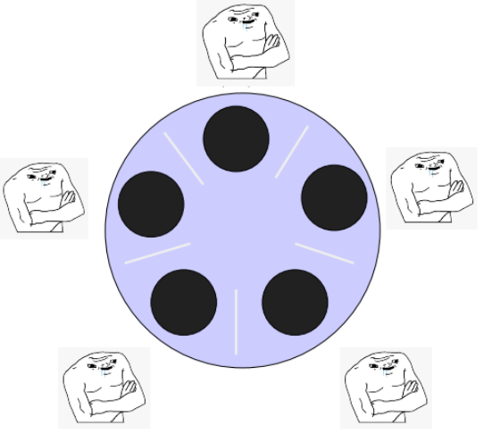

# Problema de los filósofos



Cinco filósofos se sientan alrededor de una mesa y pasan su vida cenando y pensando. 
Cada filósofo tiene un plato de fideos y un tenedor a la izquierda de su plato. Para comer los fideos son necesarios dos tenedores y cada filósofo sólo puede tomar los que están a su izquierda y derecha.
El objetivo es que ninguno de los filósofos muera de hambre a lo largo de su productiva vida.

# 
_Compilar_
```
gcc barberia.c -lpthread
```